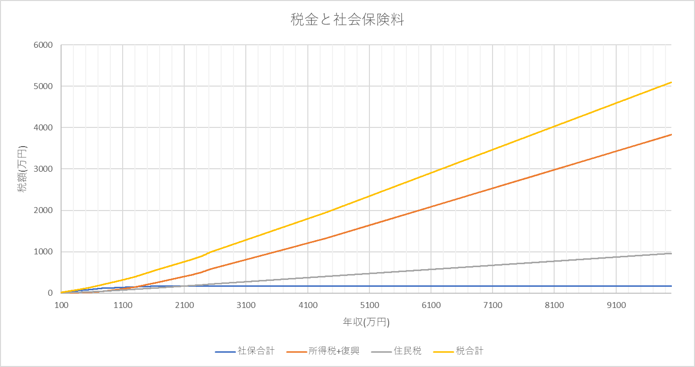
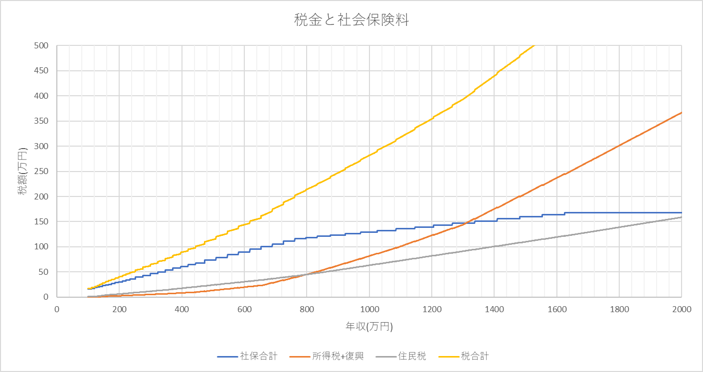
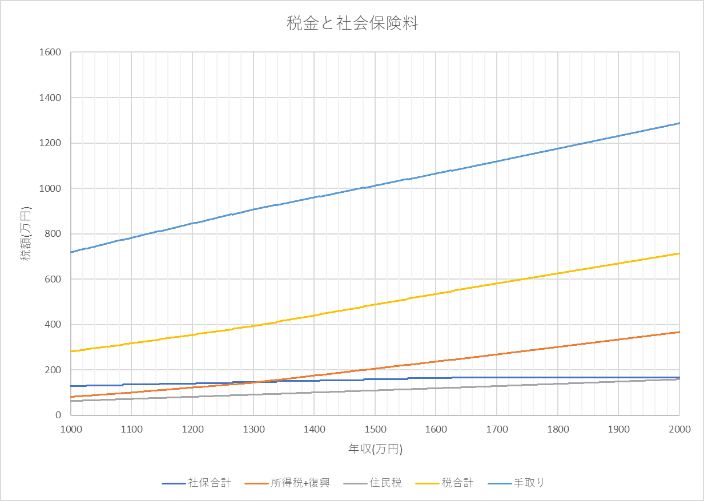
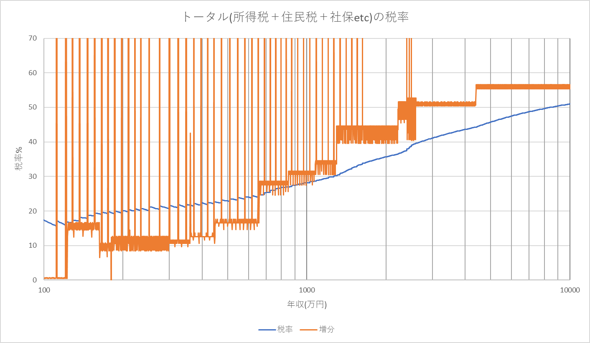
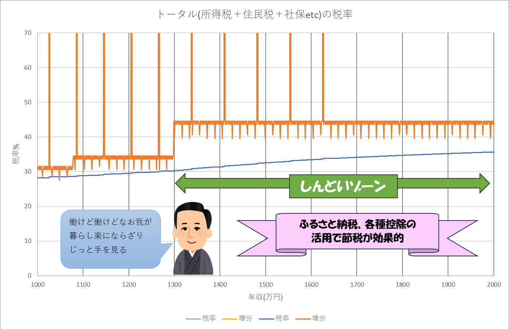
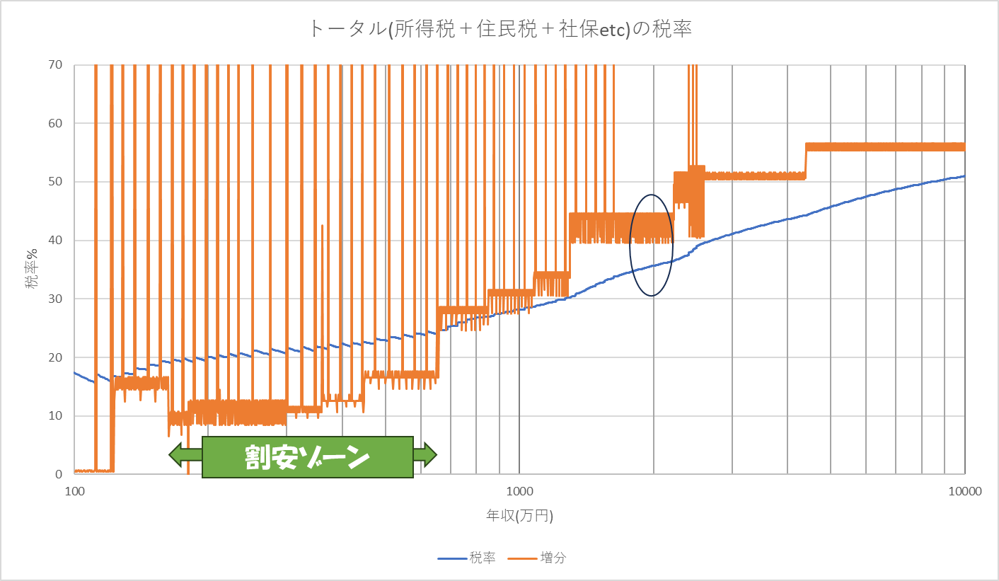
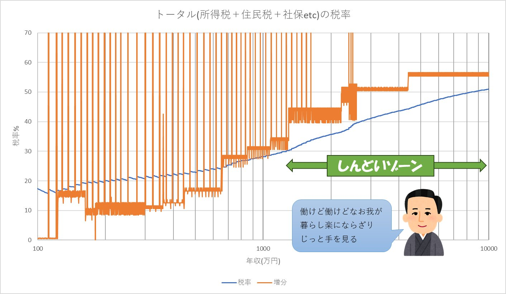

# 所得控除シミュレーション
所得税、社会保険、住民税などの計算を行うPythonのスクリプトです。

年収100万円から1億円までの所得税、社会保険、住民税、手取額を計算します。

変化が大きい部分は刻み幅を変えています。

実行結果はresult.txtに記載しています。

このテキストファイルのカンマをタブに変えてExcelに貼り付ければグラフにできます。

[実行結果のcsvはこちら](./result.csv "実行結果")

<H1>実行結果をグラフにしてみる</H1>
<h2>控除額を見てみる</h2>
100万円から1億円までの控除額です。

<H2>控除額</H2>
まずは、給与所得1億円までの控除額をグラフにします。

多くの人が該当する2000万円までを詳細に見ていきます。

社会保険料がカクカクしているのは等級というランクがあるからです。 
社保は1600万円付近でカンストするので、それ以上は増えません。 
社保を節税したいなら月給を140万円以上にしましょう。

<h2>手取り額</h2>
年収1000万円から2000万円までの手取り額をグラフ化してみます。
1000万円のときは281万円ほどが差し引かれ、2000万円のときは713万円が差し引かれます。

<H1>税率で見てみる</H1>
次に税率を考えてみましょう。青い線がトータルの税率で、オレンジの線がその増分です。

<H2>税金の増分</H2>
例えば収入が1円増えたときに何円が税＋社保で取られるかを考えましょう。それを増分と呼ぶことにします。
ある収入での増分が42%だとすると、収入が1万円増えた場合に税はトータルで4200円増えます。所得を1万円減らせば税負担は4200円減ります。

<H2>割安感を感じるゾーン</H2>
増分(オレンジ)の線が税率(青)より下にあると、税金は割安に感じてそれほど税金の重さを感じません。
割安ゾーンで増分15%の人は例えば10000円の控除があっても実際の税負担は1500円しか減りません。

<H2>重税感を感じるゾーン</H2>
逆に、増分(オレンジ)の線が税率(青)より上にあると、重税感を感じます。
このしんどいゾーンにいる人は、ふるさと納税をはじめとした各種控除を有効に活用して、節税を行うことが有効です。

